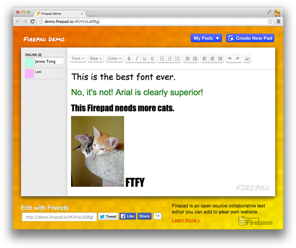

# Pyrepad (`@pyric/pad`) ⚡

**The modern ES Module, TypeScript-ready successor to Firepad — built for reactive web frameworks and real-time collaboration in the [Pyric](https://github.com/davideast/pyric) ecosystem.**

Pyrepad is an open-source, high-performance real-time collaborative code and text editing engine designed for state-of-the-art web applications, multiplayer Figma-style cursors, and AI coding co-pilots.

---

## 🏛️ Lineage & Open-Source Attribution

Pyrepad (`@pyric/pad`) is the contemporary successor to [Firepad](https://github.com/FirebaseExtended/firepad), originally created by Firebase and Google under the MIT License.

While Pyrepad cleanly re-engineers the synchronization seams for browser SharedWorkers, modular React frameworks, and AI agentive ghost diffs, we gratefully acknowledge the original Firepad team for developing the battle-tested Operational Transformation (OT) string algorithms that form our foundation.

---

## ✨ Features

* **⚡ Pure ES Module Architecture**: Subpath export maps designed for tree-shaking and zero-DOM headless server execution (`@pyric/pad/core`).
* **👥 Figma & Google Docs Multiplayer Cursors**: Sub-pixel geometric alignment with colored caret bars, username tooltip badges, and smart hover auto-fade transitions.
* **🤖 AI Agentive Collaboration Seam**: First-class support for AI co-pilots proposing tentative Operational Transformation "ghost diffs" in real time without mutating authoritative document history.
* **🔥 Native Pyric & Modular Firebase Support**: Connect directly to Firebase v9+ modular references or simulate offline/local multi-tab collaboration at 60fps over Pyric's browser **SharedWorker**.
* **🛡️ Conflict-Free & Resilient**: Sequential pending revision buffering eliminates typing stalls, while atomic initial document composing guarantees identical start-up state across all connected clients.


## Table of Contents

 * [Getting Started With Firebase](#getting-started-with-firebase)
 * [Live Demo](#live-demo)
 * [Downloading Firepad](#downloading-firepad)
 * [Documentation](#documentation)
 * [Examples](#examples)
 * [Contributing](#contributing)
 * [Database Structure](#database-structure)
 * [Repo Structure](#repo-structure)


## Getting Started With Firebase

Firepad requires [Firebase](https://firebase.google.com/) in order to sync and store data. Firebase
is a suite of integrated products designed to help you develop your app, grow your user base, and
earn money. You can [sign up here for a free account](https://console.firebase.google.com/).


## Live Demo

Visit [firepad.io](http://demo.firepad.io/) to see a live demo of Firepad in rich text mode, or the
[examples page](http://www.firepad.io/examples/) to see it setup for collaborative code editing.

[](http://demo.firepad.io/)


## Downloading Firepad

Firepad uses [Firebase](https://firebase.google.com) as a backend, so it requires no server-side
code. It can be added to any web app by including a few JavaScript files:

```HTML
<head>
  <!-- Firebase -->
  <script src="https://www.gstatic.com/firebasejs/7.13.2/firebase-app.js"></script>
  <script src="https://www.gstatic.com/firebasejs/7.13.2/firebase-auth.js"></script>
  <script src="https://www.gstatic.com/firebasejs/7.13.2/firebase-database.js"></script>

  <!-- CodeMirror -->
  <script src="https://cdnjs.cloudflare.com/ajax/libs/codemirror/5.17.0/codemirror.js"></script>
  <link rel="stylesheet" href="https://cdnjs.cloudflare.com/ajax/libs/codemirror/5.17.0/codemirror.css"/>

  <!-- Firepad -->
  <link rel="stylesheet" href="https://firepad.io/releases/v1.5.10/firepad.css" />
  <script src="https://firepad.io/releases/v1.5.10/firepad.min.js"></script>
</head>
```

Then, you need to initialize the Firebase SDK and Firepad:

```HTML
<body onload="init()">
  <div id="firepad"></div>
  <script>
    function init() {
      // Initialize the Firebase SDK.
      firebase.initializeApp({
        apiKey: '<API_KEY>',
        databaseURL: 'https://<DATABASE_NAME>.firebaseio.com'
      });

      // Get Firebase Database reference.
      var firepadRef = firebase.database().ref();

      // Create CodeMirror (with lineWrapping on).
      var codeMirror = CodeMirror(document.getElementById('firepad'), { lineWrapping: true });

      // Create Firepad (with rich text toolbar and shortcuts enabled).
      var firepad = Firepad.fromCodeMirror(firepadRef, codeMirror,
          { richTextShortcuts: true, richTextToolbar: true, defaultText: 'Hello, World!' });
    }
  </script>
</body>
```

## Documentation

Firepad supports rich text editing with [CodeMirror](http://codemirror.net/) and code editing via
[Ace](http://ace.c9.io/). Check out the detailed setup instructions at [firepad.io/docs](http://www.firepad.io/docs).


## Examples

You can find some Firepad examples [here](examples/README.md).


## Contributing

If you'd like to contribute to Firepad, please first read through our [contribution
guidelines](.github/CONTRIBUTING.md). Local setup instructions are available [here](.github/CONTRIBUTING.md#local-setup).

## Database Structure
How is the data structured in Firebase?

* `<document id>/` - A unique hash generated when pushing a new item to Firebase.
    * `users/`
        * `<user id>/` - A unique hash that identifies each user. 
          * `cursor` - The current location of the user's cursor. 
          * `color` - The color of the user's cursor.
    * `history/` - The sequence of revisions that are automatically made as the document is edited.
        * `<revision id>/` - A unique id that ranges from 'A0' onwards.
            * `a` - The user id that made the revision.
            * `o/` - Array of operations (eg TextOperation objects) that represent document changes.
            * `t` - Timestamp in milliseconds determined by the Firebase servers.
    * `checkpoint/` - Snapshot automatically created every 100 revisions.  
        * `a` - The user id that triggered the checkpoint.
        * `id` - The latest revision at the time the checkpoint was taken.
        * `o/` - A representation of the document state at that time that includes styling and plaintext.   


## Repo Structure

Here are some highlights of the directory structure and notable source files:

* `dist/` - output directory for all files generated by grunt (`firepad.js`, `firepad.min.js`, `firepad.css`, `firepad.eot`).
* `examples/` - examples of embedding Firepad.
* `font/` - icon font used for rich text toolbar.
* `lib/`
    * `firepad.js` - Entry point for Firepad.
    * `text-operation.js`, `client.js` - Heart of the Operation Transformation implementation.  Based on
      [ot.js](https://github.com/Operational-Transformation/ot.js/) but extended to allow arbitrary
      attributes on text (for representing rich-text).
    * `annotation-list.js` - A data model for representing annotations on text (i.e. spans of text with a particular
      set of attributes).
    * `rich-text-codemirror.js` - Uses `AnnotationList` to track annotations on the text and maintain the appropriate
      set of markers on a CodeMirror instance.
    * `firebase-adapter.js` - Handles integration with Firebase (appending operations, triggering retries,
      presence, etc.).
* `test/` - Jasmine tests for Firepad (many of these were borrowed from ot.js).

[gh-actions]: https://github.com/FirebaseExtended/firepad/actions
[gh-actions-badge]: https://github.com/FirebaseExtended/firepad/workflows/CI%20Tests/badge.svg
